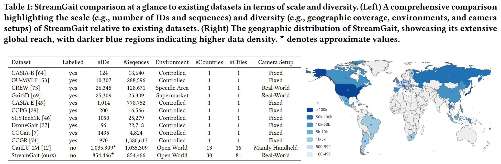

# StreamGait & MirrorGait  
**[ACM MM'25] Seeing from Magic Mirror: Contrastive Learning from Reconstruction for Pose-based Gait Recognition**

Official repository of **MirrorGait** code and the **StreamGait** dataset.

## 📌 Overview
- **StreamGait**: A large-scale, **unlabelled** gait dataset collected from **353 YouTube live-stream channels** across **30 countries / 81 cities**.  
- **MirrorGait**: A **self-supervised** 3D-aware pre-training framework that lifts 2D poses to 3D for **contrastive learning**, achieving **SOTA** on Gait3D, GREW and OUMVLP-Pose with **minimal fine-tuning**.

## 📝 TODO
- [ ] Release the data acquisition procedures and protocols.
- [ ] Release the training code and models of MirrorGait.

## 📊 Dataset Details

| Attribute        | StreamGait        | GaitLU-1M | 
|------------------|-------------------|-----------|
| **#Sequences**   | 854 k             | 1.0 M     | 
| **Camera**       | Real-world fixed  | Handheld  | 
| **Environments** | 81 cities, 30 countries | 16 cities | 

  

## 🏆 Key Numbers
| Benchmark | Rank-1 (prior SOTA) | Rank-1 (MirrorGait-ft) | Gain |
|-----------|---------------------|-------------------------|------|
| Gait3D    | 38.1 (SkeletonGait) | **48.1**                | **+10.0%** |
| GREW      | 77.4 (SkeletonGait) | **79.6**                | **+2.2%** |
| OUMVLP-Pose | 70.5 (GaitGraph2) | **73.9**         | **+3.4%** |

## 📬 Contact
For questions or collaboration: Shibei Meng, `mengshibei@mail.bnu.edu.cn`  
